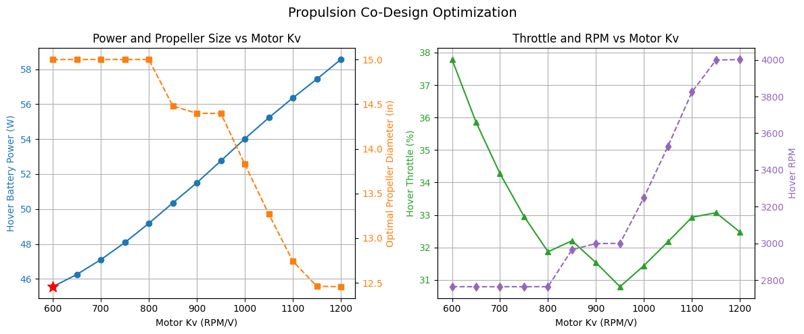
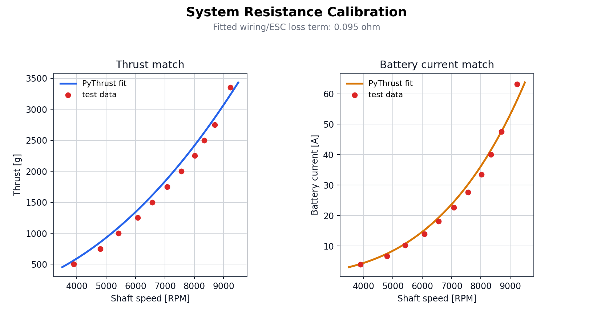
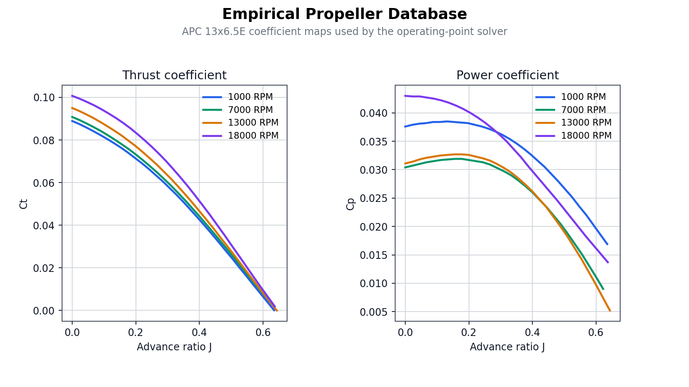
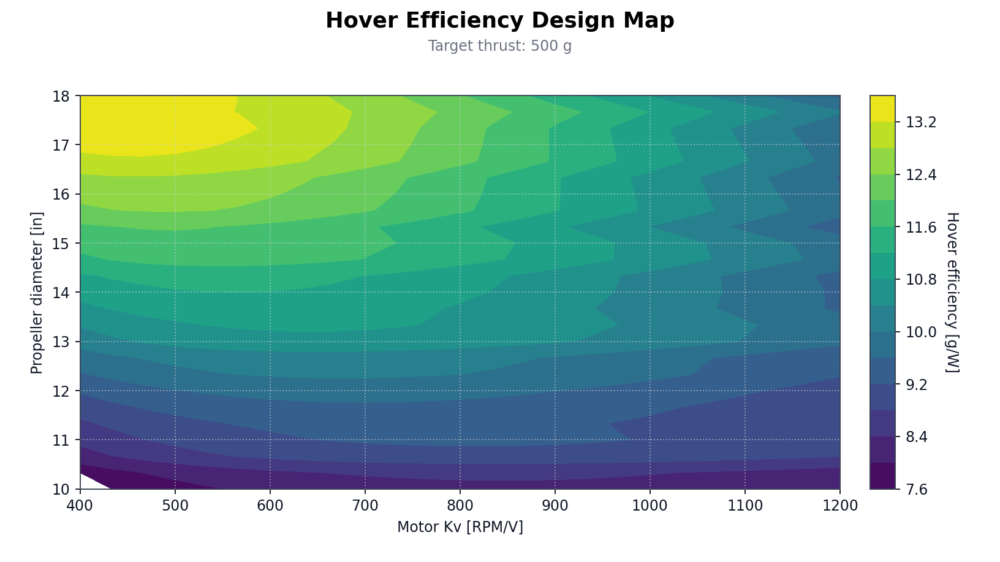
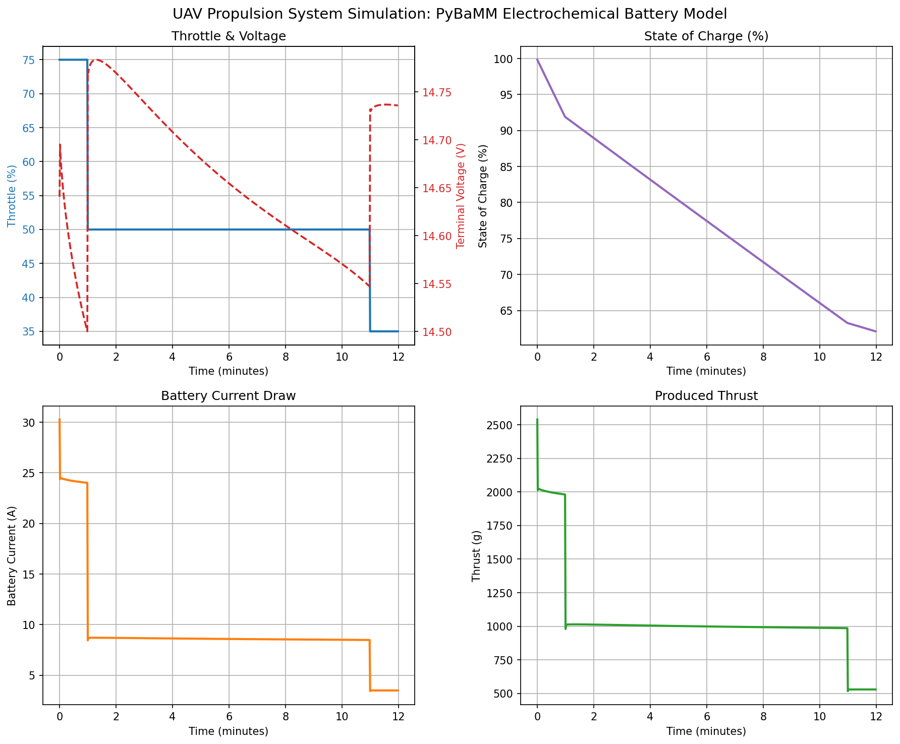

# PyThrust

PyThrust is an open-source framework for electric propulsion system analysis, co-design, and parameter optimization in UAV applications. It can be used for multidisciplinary design optimization (MDO) within OpenMDAO. It includes steady-state performance solvers, auto-tuning calibration tools to fit manufacturer test data, and database search tools to map theoretical designs onto real-world brushless motor and propeller catalogs.

## Design and Analysis Visualization

| 1. Propulsion Co-Design Optimization | 2. Propulsion Calibration & Auto-Tuning |
| :---: | :---: |
|  |  |
| **3. Propeller Aerodynamic Coefficients** | **4. Hover Efficiency Heatmap** |
|  |  |

### 5. PyBaMM Electrochemical Battery Simulation (Dynamic Load)

## Documentation

Please see the [docs/](docs/) folder for design specifications, core mathematical model descriptions, and database details.

## License

PyThrust is licensed under the Apache License, Version 2.0 (the "License"). See [LICENSE](LICENSE) for the full license.

## Copyright

Copyright (c) 2026 Hüseyin Karakaya. All rights reserved.