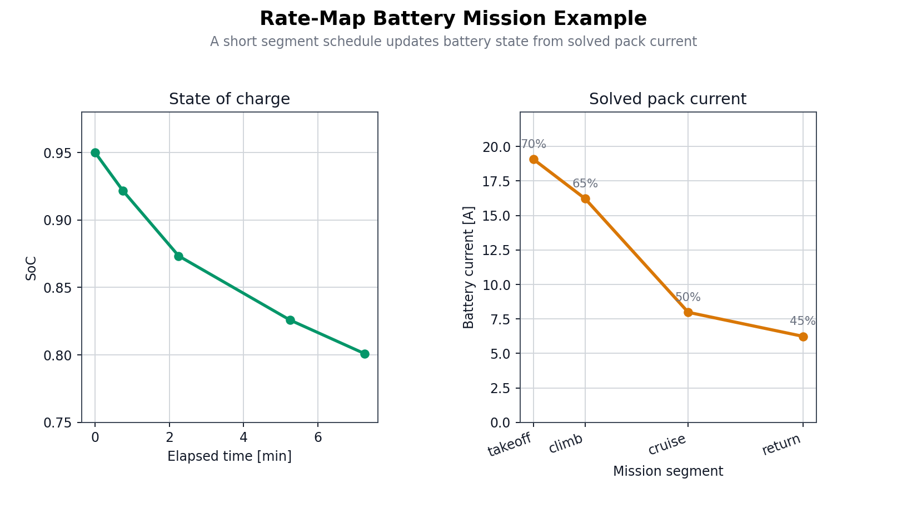

# Examples

PyThrust includes runnable examples that show the main workflows: solving and
calibrating propulsion models, inspecting rate-map battery behavior, and using
OpenMDAO for hover co-design.

Run examples from the repository root so relative `data/` and `docs/images/`
paths resolve correctly.

```bash
PYTHONPATH=. python examples/<example_name>.py
```

## Requirements

| Example | Extra dependencies |
|---|---|
| `calibrate_system_resistance.py` | Core PyThrust dependencies |
| `rate_map_battery_point_states.py` | Core PyThrust dependencies |
| `rate_map_battery_mission.py` | Core PyThrust dependencies |
| `select_motor_from_database.py` | `openmdao` |
| `openmdao_hover_optimization.py` | `openmdao`, `matplotlib` |

Install the full example environment:

```bash
pip install -e .[plot,openmdao]
```

## System Resistance Calibration

Script:

```bash
PYTHONPATH=. python examples/calibrate_system_resistance.py
```

This example identifies the lumped system resistance for a motor, propeller,
fixed-voltage battery, ESC, and wiring setup.

It uses:

| Input | Value or source |
|---|---|
| Motor | Datasheet Kv, resistance, no-load current, and current limit |
| Propeller | `APC_13x6.5E` from `data/propellers/apc_202602` |
| Battery | Fixed 4S nominal voltage, `14.8 V` |
| Test table | RPM, thrust in grams, and battery current in amps |

The output reports:

| Metric | Meaning |
|---|---|
| System resistance | Fitted `SystemSpec.resistance_ohm` |
| Thrust RMSE | Propeller-model thrust error against measured thrust |
| Current RMSE | Battery-current prediction error |
| Thrust R2 | Fit quality for the aerodynamic thrust prediction |
| Per-point table | Predicted vs measured thrust/current for each RPM row |

See [Motor Calibration](motor_calibration.md) for the calibration model and
equations.


## Rate-Map Battery Point States

Script:

```bash
PYTHONPATH=. python examples/rate_map_battery_point_states.py
```

This example loads `data/batteries/example_liion_cell.json`, applies a `4S2P`
pack topology, and evaluates the same state of charge under several requests.

It demonstrates:

| Query | Meaning |
|---|---|
| `state_at_current` | Terminal voltage and power at a requested pack current |
| `state_at_c_rate` | Current/voltage behavior at a requested cell C-rate |
| `state_at_voltage` | Current required to hold a requested pack voltage |
| `state_at_power` | Current and voltage for a requested pack power |
| `state_at_load_resistance` | Battery behavior under a resistive load |
| Infeasible power | How the model reports a power limit |

This example is intentionally independent from the propulsion solver. It
validates the battery model surface before mission or solver integration.

## Rate-Map Battery Mission

Script:

```bash
PYTHONPATH=. python examples/rate_map_battery_mission.py
```

This example couples `RateMapBattery` to `PropulsionSolver` over a short
segment schedule. Each segment solves the propulsion operating point using the
current battery state, reports pack current and voltage, then advances state of
charge from the solved battery current.

It demonstrates:

| Step | Meaning |
|---|---|
| Load cell data | Use `data/batteries/example_liion_cell.json` with explicit series and parallel counts |
| Solve segment | Pass `battery_state` into `solve_operating_point(...)` |
| Read outputs | Inspect `battery_voltage_v` and `battery_current_a` on `OperatingPoint` |
| Advance state | Use `step_current(...)` to update SoC for the next segment |



## Motor Selection

Script:

```bash
PYTHONPATH=. python examples/select_motor_from_database.py
```

This example combines theoretical co-design with real motor database lookup.

Workflow:

1. Load `APC_13x6.5E` propeller data.
2. Use OpenMDAO to find an efficient theoretical motor/propeller/throttle
   combination for hover.
3. Load the brushless motor database from `data/motors`.
4. Search real motors near the optimized Kv and current requirement.
5. Print the top candidates sorted by winding resistance and weight.

The optimization target is a hover thrust of `4.903 N`, approximately `500 gf`.

See [Component Databases](databases.md) for motor catalog format and query
helpers.

## OpenMDAO Hover Optimization

Script:

```bash
PYTHONPATH=. python examples/openmdao_hover_optimization.py
```

This example demonstrates OpenMDAO-based propulsion co-design and a parametric
Kv sweep.

It performs three stages:

1. Run the baseline propulsion model.
2. Optimize motor Kv, propeller diameter, and throttle for a fixed hover thrust.
3. Sweep Kv and re-optimize diameter/throttle at each point.

The generated plot is saved to:

```text
docs/images/optimize_and_plot_results.png
```

The plot shows:

| Panel | Shows |
|---|---|
| Power and propeller sizing | Hover battery power and optimized propeller diameter |
| Control setting and shaft speed | Optimized throttle setting and shaft speed |


See [Propulsion Solver](usage.md) for the operating-point solver used inside
the OpenMDAO component.
