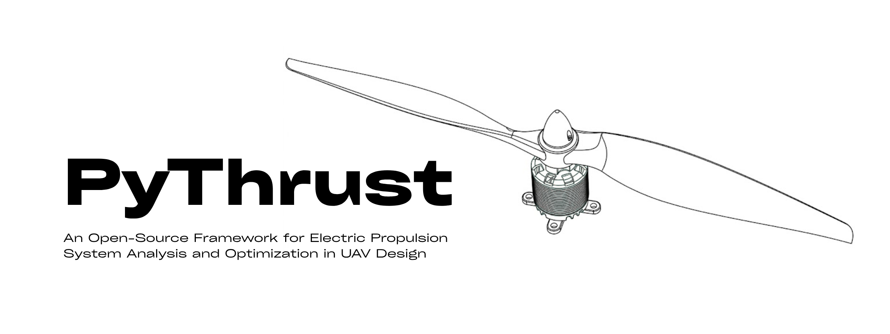

# PyThrust

Welcome to the official documentation for **PyThrust** - an open-source Python framework for electric propulsion system analysis, co-design, and parameter optimization in UAV applications.

PyThrust combines empirical propeller data, brushless motor models, battery/system loss modeling, and OpenMDAO integration so UAV designers can move from theoretical propulsion sizing to real component choices with traceable calculations.

---

## Why PyThrust?

Electric UAV propulsion design usually crosses several domains: aerodynamics, motor electrical behavior, battery loading, component catalogs, and mission constraints. PyThrust keeps those pieces in one workflow:

* **Coupled operating-point solver:** Solve equilibrium RPM, thrust, torque, current, power, and efficiency for a motor, propeller, battery, and flight condition.
* **Catalog-backed selection:** Query real brushless motor and propeller datasets instead of optimizing against abstract components only.
* **Calibration tools:** Fit lumped system resistance from test-stand data to account for ESC, battery, wiring, and connector losses.
* **Optimization-ready components:** Use the propulsion solver inside OpenMDAO for multidisciplinary design optimization studies.
* **Optimization-ready examples:** Generate plots for design sweeps, calibration quality, propeller coefficients, and hover efficiency maps.

---

## Feature Visuals

| System Resistance Calibration | OpenMDAO Hover Co-Design |
| :---: | :---: |
|  |  |
| **Empirical Propeller Database** | **Hover Efficiency Map** |
|  |  |

## Key Documentation Sections

* [**Getting Started**](getting_started.md): Installation, optional extras, and a first operating-point solve.
* [**Propulsion Solver**](usage.md): Solver configuration, feasibility rules, and usage examples.
* [**Motor Calibration**](motor_calibration.md): Fit system resistance from manufacturer or thrust-stand data.
* [**Examples**](examples.md): Runnable scripts for calibration, motor selection, and OpenMDAO optimization.
* [**API Reference**](api_reference.md): Main classes, database loaders, calibration objects, and OpenMDAO wrapper.
* [**Propulsion and Battery Theory**](theory.md): Propeller, motor, battery, electrical loss, and coupled equilibrium equations.
* [**Component Databases**](databases.md): Propeller CSV/JSON and motor catalog formats.
* [**Development & Testing**](development.md): Local setup, tests, examples, and documentation build commands.
