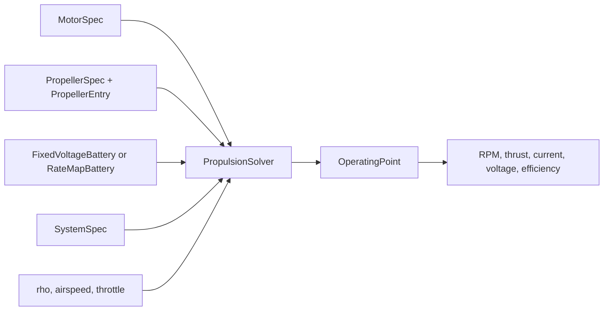

# Propulsion Solver User & API Guide

This guide describes how PyThrust solves a motor-propeller operating point and how to interpret the result.

!!! question "Core solver question"
    Given a motor, propeller, battery, throttle, and airspeed, what shaft RPM makes the electrical motor model and propeller aerodynamic load agree?

!!! abstract "Use this page when"
    You are wiring the solver into an analysis script, checking why a point is infeasible, or confirming how battery voltage enters the RPM root solve.

---

## Solver Inputs

The operating-point solver combines five inputs:

| Input | Class or value | Purpose |
|---|---|---|
| Motor | `MotorSpec` | Kv, winding resistance, no-load current, current limit, optional higher-order loss terms |
| Battery | `FixedVoltageBattery` or `RateMapBattery` | Fixed pack voltage or state-dependent pack voltage from cell curves |
| System | `SystemSpec` | Lumped resistance for ESC, battery internal resistance, wiring, and connectors |
| Propeller | `PropellerSpec` + `PropellerEntry` | Geometry plus empirical aerodynamic coefficients |
| Flight condition | `rho`, `airspeed_mps`, `throttle` | Air density, freestream speed, and commanded voltage fraction |

---

## Symbols

| Symbol | Meaning |
|---|---|
| $\text{RPM}$ | Propeller shaft speed being solved |
| $n$ | Shaft speed in revolutions per second |
| $V$ | Flight airspeed |
| $D$ | Propeller diameter |
| $J$ | Propeller advance ratio |
| $C_t$, $C_p$ | Propeller thrust and power coefficients |
| $T$ | Thrust |
| $Q$ | Propeller shaft torque |
| $K_v$ | Motor speed constant |
| $K_t$ | Motor torque constant |
| $I$ | Motor winding current |
| $I_0$ | No-load current |
| $R_m$ | Motor winding resistance |
| $R_{\text{system}}$ | Lumped system resistance |
| $V_{\text{back}}$ | Motor back-EMF voltage |
| $V_m$ | Motor terminal voltage |
| $V_{\text{pack}}$ | Battery pack voltage |
| $x$ | Battery depth of discharge |

---

## What the Solver Does



### Step 1: Evaluate the propeller at a candidate RPM

For each candidate RPM, PyThrust converts shaft speed to revolutions per second:

$$
n = \frac{\text{RPM}}{60}
$$

Then it calculates the propeller advance ratio:

$$
J = \frac{V}{nD}
$$

The propeller database returns empirical coefficients at that RPM and advance ratio:

$$
C_t = C_t(\text{RPM}, J)
$$

$$
C_p = C_p(\text{RPM}, J)
$$

From those coefficients, PyThrust computes thrust, torque, and shaft power:

$$
T = C_t \rho n^2 D^4
$$

$$
Q = \frac{C_p \rho n^2 D^5}{2\pi}
$$

$$
P_{\text{shaft}} = C_p \rho n^3 D^5
$$

### Step 2: Evaluate the motor state

By default, PyThrust uses a first-order brushless DC motor model. The torque constant is:

$$
K_t =
\frac{30}{\pi K_v}
$$

The motor current needed to drive the propeller torque is:

$$
I =
\frac{Q}{K_t} + I_0
$$

The back-EMF voltage is:

$$
V_{\text{back}} =
\frac{\text{RPM}}{K_v}
$$

The motor terminal voltage is:

$$
V_m =
V_{\text{back}} + I R_m
$$

### Drela / QPROP Motor Model Notes

`MotorSpec` also includes optional parameters inspired by Mark Drela's QPROP motor models:

| Field | Effect |
|---|---|
| `torque_constant_kv_ratio` | Adjusts the relation between speed constant and torque constant |
| `magnetic_lag_tau` | Adds magnetic lag to the back-EMF relation |
| `no_load_current_linear` | Adds a linear speed term to no-load current |
| `no_load_current_quadratic` | Adds a quadratic speed term to no-load current |
| `resistance_quadratic` | Adds current-dependent winding resistance |
| `iron_loss_exponent` | Scales no-load current with RPM using a power law |

When these fields are left at their defaults, the model reduces to the simpler first-order motor equations above. See [Propulsion and Battery Theory](theory.md) for the full equations and Drela references.

---

## Equilibrium RPM

The throttle command defines the average voltage available from the battery:

$$
V_{\text{applied}} =
\text{throttle} \cdot V_{\text{pack}}
$$

For `FixedVoltageBattery`, `V_pack` is the configured pack voltage. For
`RateMapBattery`, `V_pack` is evaluated from the current battery state and the
current implied by the candidate RPM:

!!! note "Rate-map batteries are state dependent"
    A `RateMapBattery` solve needs a `BatteryState` because terminal voltage depends on both depth of discharge and current.

$$
V_{\text{pack}} = V_{\text{pack}}(x, I)
$$

The solver searches for the RPM where the motor voltage demand plus system voltage drop equals the applied voltage:

$$
g(\text{RPM}) =
V_m(\text{RPM})
+ I(\text{RPM}) R_{\text{system}}
- V_{\text{applied}}
$$

The equilibrium point is:

$$
g(\text{RPM}) = 0
$$

PyThrust solves this scalar root-finding problem with Brent's method through `scipy.optimize.root_scalar`.

---

## RPM Bracket

Before solving, PyThrust builds a search interval:

| Bound | How it is chosen |
|---|---|
| Lower RPM | At least `SolverConfig.rpm_min`; raised if airspeed and propeller `J` range require a higher RPM |
| Upper RPM | Estimated from `motor.kv_rpm_per_v * battery.terminal_voltage(0 A) * throttle`, then expanded by `rpm_max_margin` |

If the residual does not change sign inside the bracket, the point is returned as infeasible with reason `no_bracket`.

---

## Solver Configuration

The numerical behavior of the root finder is controlled by `SolverConfig`:

| Parameter | Type | Default | Description |
|---|---|---:|---|
| `rpm_min` | `float` | `100.0` | Lower bound limit for RPM |
| `rpm_max_margin` | `float` | `1.1` | Safety scaling factor applied to the upper RPM estimate |
| `eps_rpm` | `float` | `1e-8` | Convergence tolerance for shaft speed |
| `eps_v` | `float` | `1e-8` | Voltage residual tolerance |
| `max_iter` | `int` | `100` | Maximum root-finder iterations |

---

## Result Fields

`solve_operating_point(...)` returns an `OperatingPoint`:

| Field | Meaning |
|---|---|
| `rpm` | Solved shaft speed |
| `advance_ratio` | Propeller advance ratio at the solved point |
| `ct`, `cp` | Interpolated thrust and power coefficients |
| `thrust_n` | Thrust force |
| `torque_nm` | Propeller shaft torque |
| `shaft_power_w` | Mechanical shaft power |
| `motor_power_w` | Electrical power at motor terminals |
| `battery_power_w` | Battery-side power including system losses |
| `battery_voltage_v` | Battery terminal pack voltage at the solved point |
| `battery_current_a` | Battery DC current draw at the solved point |
| `battery_c_rate` | Cell C-rate for rate-map batteries, or `0.0` for fixed-voltage batteries |
| `battery_efficiency` | Discharge efficiency from the active battery model |
| `motor_current_a` | Motor winding current |
| `motor_voltage_v` | Motor terminal voltage |
| `propeller_efficiency` | Propulsive efficiency based on thrust power |
| `motor_efficiency` | Shaft power divided by motor electrical power |
| `system_efficiency` | Thrust power divided by battery power |
| `is_feasible` | Whether the point passed feasibility checks |
| `infeasible_reason` | Reason string when `is_feasible` is false |

---

## Feasibility Rules

An operating point is marked as infeasible when one of these checks fails:

| Reason | Meaning |
|---|---|
| `throttle<=0` | No positive throttle command |
| `no_bracket` | The RPM search interval does not contain a valid voltage-balance root |
| `no_convergence` | The root finder did not converge |
| `current_limit` | `motor_current_a` exceeds `current_max_a` |
| `battery_current_limit` | Rate-map battery current exceeds the configured cell current limit |
| `battery_voltage_cutoff` | Rate-map battery terminal cell voltage falls below cutoff |
| `battery_voltage_limit` | Rate-map battery terminal cell voltage exceeds the configured charge voltage |
| `battery_state_limit` | Rate-map battery state is outside the valid range |
| `invalid_coefficients` | Propeller coefficient lookup produced non-physical values |
| `invalid_efficiency` | Computed efficiency is outside the physically expected range |

---

## Example Usage

Here is a complete example showing how to load a propeller dataset, define specifications, and solve for an operating point:

```python
from pathlib import Path

from pythrust.battery import FixedVoltageBattery
from pythrust.propellers import PropellerDatabase
from pythrust.propulsion import (
    MotorSpec,
    PropellerSpec,
    PropulsionSolver,
    SystemSpec,
)

db = PropellerDatabase()
db.load(Path("data/propellers/apc_202602"), strict=False)
prop_entry = db.get("APC_13x6.5E")

motor = MotorSpec(
    kv_rpm_per_v=860.0,
    resistance_ohm=0.0258,
    no_load_current_a=1.3,
    current_max_a=65.0,
)

battery = FixedVoltageBattery(
    voltage_v=14.8,
    discharge_efficiency=1.0,
)

system = SystemSpec(resistance_ohm=0.05)
propeller = PropellerSpec(diameter_m=0.3302, blade_count=2)

solver = PropulsionSolver()
point = solver.solve_operating_point(
    motor=motor,
    battery=battery,
    system=system,
    propeller=propeller,
    prop_entry=prop_entry,
    rho=1.225,
    airspeed_mps=15.0,
    throttle=0.7,
)

print(f"RPM             : {point.rpm:.1f}")
print(f"Thrust          : {point.thrust_n:.2f} N")
print(f"Motor Current   : {point.motor_current_a:.2f} A")
print(f"Battery Voltage : {point.battery_voltage_v:.2f} V")
print(f"Battery Current : {point.battery_current_a:.2f} A")
print(f"Battery Power   : {point.battery_power_w:.1f} W")
print(f"Feasible        : {point.is_feasible}")
print(f"Reason          : {point.infeasible_reason}")
```

For a rate-map battery, load a cell dataset, create an explicit battery state,
and pass that state into the solver:

```python
from pythrust.battery import BatteryState, RateMapBattery

battery = RateMapBattery.from_json(
    "data/batteries/example_liion_cell.json",
    series=4,
    parallel=2,
)
state = BatteryState(soc=0.85)

point = solver.solve_operating_point(
    motor=motor,
    battery=battery,
    battery_state=state,
    system=system,
    propeller=propeller,
    prop_entry=prop_entry,
    rho=1.225,
    airspeed_mps=10.0,
    throttle=0.6,
)
```
